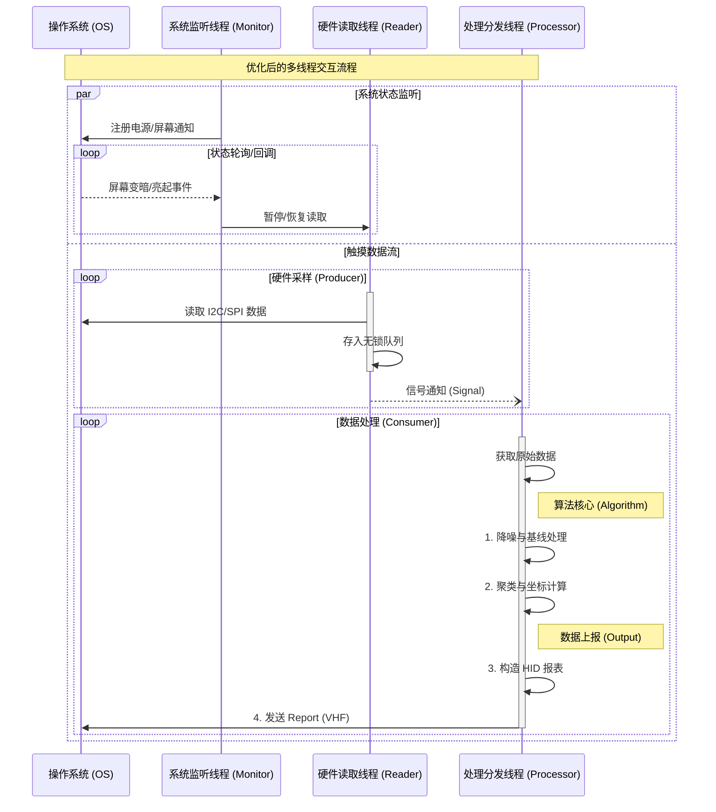

# 架构设计方案：VHF 触摸驱动重构 (多线程版)

本方案采用多线程流水线架构，以提高触摸响应速度并防止硬件 I/O 阻塞算法处理。

## 1. 核心目标
- **高并发与低延迟**：通过流水线并行处理，最大化吞吐量。
- **职责分离**：I/O (硬件/HID) 与 CPU 密集型任务 (算法) 分离。
- **线程安全**：通过线程安全队列进行模块间通信。

## 2. 线程模型

系统将划分为以下 4 个主要执行上下文：

### 2.1 主控线程 (Main Thread)
- **职责**: 程序的入口与指挥官。
- **功能**:
    - 初始化并启动子线程。
    - 响应系统监听线程发来的事件，控制 Worker 线程的暂停与恢复。

### 2.2 系统状态监听线程 (System Monitor Thread) - *Watcher*
- **职责**: 独立监听系统硬件状态变化，避免阻塞主线程或工作线程。
- **功能**:
    - 监听 `GUID_MONITOR_POWER_ON` (屏幕亮灭)。
    - 监听 `GUID_POWERSCHEME_PERSONALITY` (电源模式)。
    - 检测到变化时，通过回调/事件通知主控线程。

### 2.3 硬件读取线程 (Hardware Input Thread) - *Producer*
- **职责**: 专注于从 SPI/I2C 总线读取数据。
- **行为**:
    - 循环读取 Himax 芯片的原始电容数据。
    - 将读取到的 `RawData` 放入 **共享队列**。
    - 屏幕关闭时进入等待状态以省电。

### 2.4 数据处理与输出线程 (Processing & Output Thread) - *Consumer*
- **职责**: 算法计算与 HID 报表发送的流水线。
- **注意**: 将算法与发送合并，减少一次线程上下文切换开销（通常算法耗时较短，直接发送更高效）。
- **行为**:
    - 从 **共享队列** 获取 `RawData`。
    - **算法阶段**: 执行降噪、基线扣除、聚类、坐标计算。
    - **输出阶段**: 将坐标转换为 HID 报表，直接调用 VHF API 发送。

## 3. 并发架构图



## 4. 推荐目录结构

```text
EGoTouchRev/
├── Common/
│   ├── include/
│   │   ├── ThreadSafeQueue.h
│   │   ├── WorkerThread.h
│   │   └── Logger.h
│   └── source/
│
├── Hardware/                   # 驱动与管线层
│   ├── include/
│   │   ├── Himax/
│   │   │   ├── HimaxChip.h     # 芯片控制器 (管理者)
│   │   │   └── InputPipeline.h # IO 管线 (执行者)
│   │   └── ITouchDevice.h
│   └── source/
│
├── Processing/                 # 处理与管线层
│   ├── include/
│   │   ├── TouchAlgo.h
│   │   ├── HidOutput.h
│   │   └── ProcessPipeline.h   # 处理管线 (执行者)
│   └── source/
│
├── System/                     # 监听层
│   ├── include/
│   │   └── MonitorPipeline.h   # 监听管线 (执行者)
│   └── source/
│
└── Service/
    ├── include/
    │   └── ServiceContext.h    # 线程控制器
    └── source/
        └── main.cpp
```

## 5. 关键技术点
1.  **线程合并优势**: 减少了算法线程与输出线程之间的数据拷贝和锁竞争，降低延迟。
2.  **独立监听**: 确保在 I2C 总线繁忙或算法高负载时，系统依然能及时响应屏幕开关事件。
